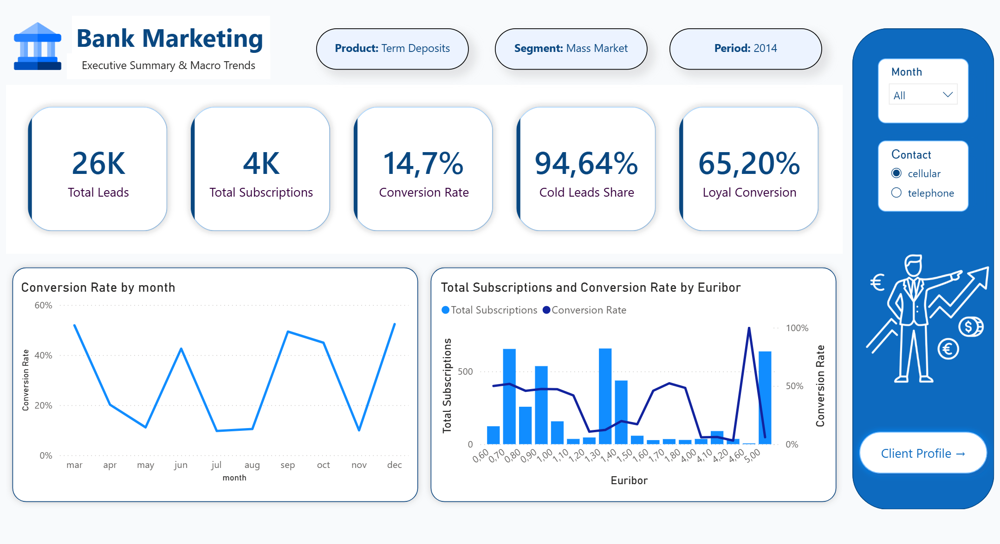
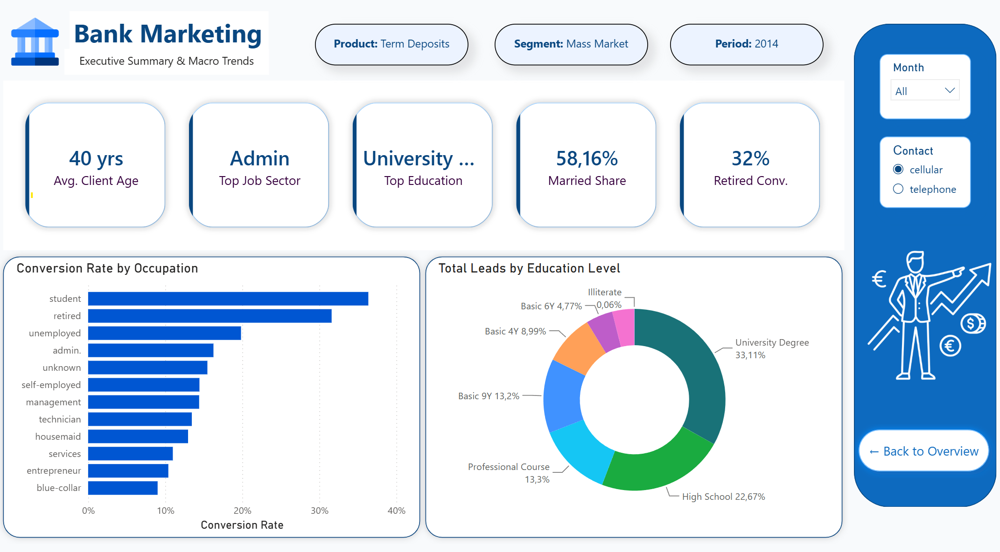
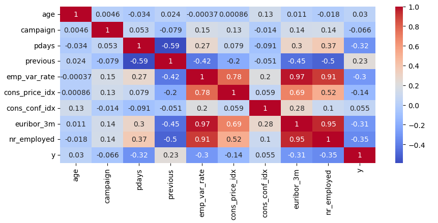
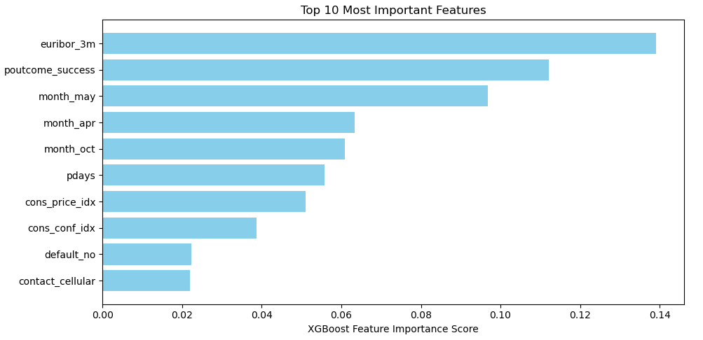

# Bank Marketing: Optimization of Telemarketing Campaigns via ML & Analytics

An end-to-end data analytics and data science project designed to optimize bank telemarketing campaigns, improve conversion rates, and build a robust predictive pipeline. The project encompasses database extraction via SQL, exploratory data analysis and machine learning implementation in Python, and interactive business intelligence dashboard design within Power BI.

---

## 📊 Interactive Dashboard Preview

### 1. Executive Summary & Macro Trends

  

### 2. Client Profile & Conversion Deep-Dive

  

---

## 🛠️ Project Architecture & Tech Stack

*   **Database Management:** PostgreSQL (Data aggregation, cohort analysis, and macroeconomic feature bucketization)
*   **Machine Learning Pipeline:** Python (Pandas, NumPy, Scikit-Learn, XGBoost, Matplotlib, Seaborn)
*   **ETL & Modeling:** Power Query (Star schema optimization, relationship mapping, and text normalization)
*   **Business Intelligence:** Power BI Desktop (DAX-driven business KPIs and interactive UI/UX layout)

---

## 📂 Repository Structure

*   `data/` : Raw source datasets containing telemarketing campaign features.
*   `notebooks/` : Production Jupyter Notebook covering the end-to-end Python EDA and machine learning pipeline.
*   `sql/` : Production-ready `.sql` scripts executing structured exploratory queries.
*   `power bi/` : Core interactive `.pbix` dashboard file containing data models and visualization layouts.

---

## 🔍 Detailed Project Phases

## Phase 1: Database Management & Exploratory SQL Queries (PostgreSQL)

To extract baseline operational trends and structure customer cohorts, structural analytical queries were written in PostgreSQL:

* **Campaign Efficiency & Volumetric Spam Risk**
  Calculated conversion rates mapped directly against call frequency volumes (`campaign`) to determine at what point subsequent call attempts yield diminishing returns.

* **Seasonality Analysis**
  Evaluated call conversions distributed by month, using string-to-date conversion (`to_date(month, 'Mon')`) to isolate high-performing campaign cycles.

* **Granular Customer Profiling**
  Built robust aggregations evaluating conversion distribution across distinct job categories, marital statuses, and educational tiers.

* **Demographic Age Bucketization**
  Implemented `CASE WHEN` conditional logic separating customers into structural age groups (`Under 25`, `25-39`, `40-59`, `60 and older`) to identify the highest converting age dynamics.

* **Macroeconomic Index Correlations**
  Executed mathematical rounding and grouping (`numeric` casting) across key financial market indicators—specifically the **3-month Euribor rate**, **Consumer Price Index (Inflation)**, and **Consumer Confidence Index**—to map macroscopic shifts against conversion probabilities.

---

## Phase 2: Python Exploratory Data Analysis & Machine Learning Pipeline

The core data science objective focused on building a predictive pipeline to classify high-probability conversion leads while heavily mitigating operational call overhead.

* **Rigorous Data Leakage Prevention**
  Dropped the `duration` feature (call length) immediately prior to modeling. Since call duration is unknown before an agent dials, including it creates an artificial feature reliance that destabilizes real-world deployment.

* **Multicollinearity Treatment**
  A correlation matrix heatmap revealed severe multicollinearity among macroeconomic metrics (e.g., `emp_var_rate`, `euribor_3m`, and `nr_employed` correlated between **0.91 and 0.97**). The features `emp_var_rate` and `nr_employed` were dropped, retaining `euribor_3m` as a reliable proxy for the financial climate.
  
  

    
  

* **Addressing Extreme Class Imbalance**
  The target variable `y` revealed a severe **89% to 11%** skew (only ~11% conversion rate). Standard accuracy metric was rejected as useless (a dummy model would score 88.7% while delivering zero value). Optimization targeted **Recall** and **F1-Score** using a **Stratified Train/Test Split** to strictly maintain class distributions.

* **Advanced Feature Engineering (`pdays` engineering)**
  Handled the missing-value flag `999` (denoting a customer was never previously contacted). Leaving it as-is misleads linear models; converting it to zero falsely implies immediate contact. Instead, a custom processing function isolated it into a binary flag `pdays_never_contacted` and mapped the remaining values to `-1`.

* **Isolated Preprocessing Pipelines**
  Deployed explicit `ColumnTransformer` frameworks to prevent train-test data leakage:
  
  * *i. Linear Pipeline:* Implemented `OneHotEncoder(handle_unknown='ignore')` combined with `StandardScaler()` scaling for a baseline **Logistic Regression** model.
  * *ii. Tree Pipeline:* Isolated native, unscaled numerical parameters directly for gradient boosting models.

* **Out-of-Fold Threshold Optimization**
  Trained an `XGBClassifier` pipeline on the native distribution to yield unskewed probability scores. Instead of relying on a default 0.5 classification cutoff, **5-fold Cross-Validation** (`cross_val_predict`) was run exclusively on the training subset to extract precise out-of-fold probabilities. By plotting the Precision-Recall curve, the **optimal F1-score threshold was calculated at 0.1393**.

* **Model Insights (Feature Importance)**
  The trained XGBoost model identified that macroeconomic indicators—specifically the **3-month Euribor rate** (`euribor_3m`)—and previous marketing campaign success (`poutcome_success`) are the strongest predictors of customer conversion.
  
  

    
  

---

## Phase 3: Business BI Insights & Estimated Business Value

The optimized model outputs and raw data structures were compiled into a Power BI business dashboard utilizing a normalized data structure.

* **High-Level KPI Tracking**
  The dashboard maps **26K Total Leads** resulting in **4K Total Subscriptions**, defining an exact overall baseline **Conversion Rate of 14.7%**. Cold leads dominate the historical mix at **94.64%**.

* **Demographic Core Profiles**
  Pinpoints the average target client age (**40 years old**), primary targeted job sector (**Admin**), primary education tier (**University Degree**), and the structural marital baseline (**58.16% Married Share**).

* **Macro Economic Filtering**
  The dashboard isolates structural performance drops when the 3-month Euribor interest rate surges, directly proving that economic headwinds filter conversion metrics far heavier than individual operator behaviors.

> [!IMPORTANT]
> ### 📈 Measurable Business Impact
> * **4x Operational Efficiency Multiplier:** Shifting the calling strategy classification cutoff to the cross-validated optimal threshold of `0.1393` drove final model Precision to **47%** on the unseen test set. Compared to a blind, un-targeted database call strategy (11.3% conversion context), the marketing team becomes **over 4x more efficient** per call hour.
> * **Resource Optimization:** The operational threshold successfully captures **60% of all available conversions** while shielding sales reps from calling the massive bulk of non-responsive prospects, drastically slashing the bank's Cost Per Acquisition (CPA).

---

## 🚀 How to Access and Review the Project

1.  **Inspect Codebases:** Review the PostgreSQL processing architecture directly inside `sql/eda_queries.sql` or evaluate the model tuning iterations inside the `notebooks/` directory.
2.  **Run the Interactive Model:** Download the **`Bank_Marketing_Visual.pbix`** file located within the `power bi/` folder and open it locally via **Power BI Desktop** to test the interactive cross-filtering, slicers, and navigation mechanisms.
